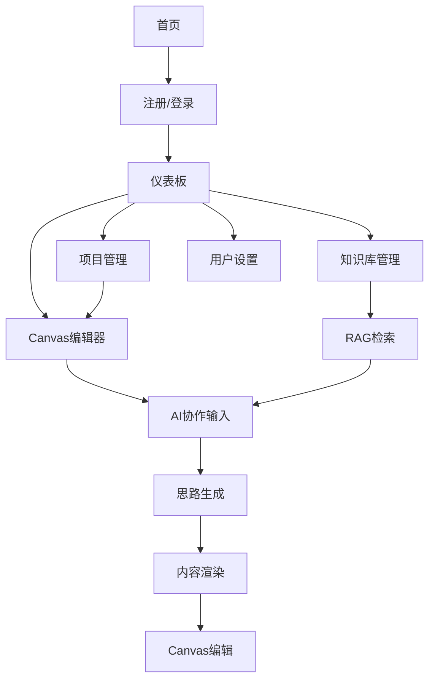

# 论文写作助手 - 产品需求文档

## 1. Product Overview
一个基于AI的智能论文写作助手平台，集成大语言模型(LLM)为学术研究者提供交互式的论文写作支持。
- 通过创新的Canvas交互式编辑界面，实现人机协作写作，解决学术写作中的语言表达、结构组织、文献引用等痛点。
- 目标用户为研究生、博士生、学者和科研工作者，帮助他们在交互式环境中更高效地完成高质量学术论文。

## 2. Core Features

### 2.1 User Roles
| Role | Registration Method | Core Permissions |
|------|---------------------|------------------|
| 免费用户 | 邮箱注册 | 基础Canvas编辑，每日限量使用AI功能 |
| 付费用户 | 邮箱注册+订阅 | 无限制AI辅助，高级Canvas功能，云端同步，RAG知识增强 |

### 2.2 Feature Module
我们的论文写作助手包含以下主要页面：
1. **首页**: 产品介绍、Canvas演示、用户注册入口
2. **登录/注册页**: 用户认证、账户管理
3. **仪表板**: 项目概览、最近文档、使用统计
4. **Canvas编辑器**: 交互式写作画布、AI协作界面、实时渲染
5. **项目管理页**: 论文项目列表、创建新项目、项目设置
6. **知识库管理**: 文献上传、RAG知识库构建、智能检索
7. **用户设置页**: 个人信息、订阅管理、偏好设置

### 2.3 Page Details
| Page Name | Module Name | Feature description |
|-----------|-------------|---------------------|
| 首页 | Hero区域 | 展示Canvas交互式编辑核心价值，包含注册CTA按钮，动态演示AI协作写作 |
| 首页 | 功能展示 | 通过交互式演示展示Canvas编辑、AI思路生成、实时渲染等核心功能 |
| 登录/注册页 | 用户认证 | 邮箱密码登录注册，第三方登录，密码重置功能 |
| 仪表板 | 项目概览 | 显示用户所有论文项目，快速访问最近编辑的Canvas文档 |
| 仪表板 | 使用统计 | 展示AI使用次数、Canvas编辑时长、月度写作进度统计 |
| Canvas编辑器 | 交互式画布 | 可视化论文结构展示，支持拖拽编辑，实时预览，多层级大纲视图 |
| Canvas编辑器 | AI协作区域 | 底部输入框，用户输入写作要求，AI返回修改思路和文本，实时渲染到Canvas |
| Canvas编辑器 | 智能渲染 | AI生成内容自动渲染到Canvas指定位置，支持用户直接编辑和调整 |
| Canvas编辑器 | 版本控制 | Canvas状态保存，支持撤销重做，版本历史对比 |
| 项目管理页 | 项目列表 | 创建、删除、重命名论文项目，Canvas模板选择，项目分享 |
| 项目管理页 | 协作功能 | 多人Canvas协作编辑，实时同步，评论和建议系统 |
| 知识库管理 | 文献上传 | 支持PDF、DOC等格式文献上传，自动解析和索引 |
| 知识库管理 | RAG检索 | 基于用户写作内容智能检索相关文献，知识增强生成 |
| 用户设置页 | 个人资料 | 修改个人信息、头像上传、学术背景设置 |
| 用户设置页 | 订阅管理 | 查看订阅状态、升级付费计划、Canvas使用量统计 |

## 3. Core Process
**Canvas交互式写作流程**: 登录 → 选择/创建项目 → 进入Canvas编辑器 → 查看现有大纲/内容 → 在底部输入框输入写作要求 → AI分析并返回修改思路 → AI生成内容渲染到Canvas → 用户在Canvas上直接编辑调整 → 继续交互式写作

**RAG增强写作流程**: 上传相关文献到知识库 → 系统自动构建向量索引 → 在Canvas写作过程中自动检索相关知识 → AI结合检索结果生成更准确的内容 → 渲染到Canvas供用户编辑

**协作编辑流程**: 项目创建者分享Canvas → 协作者加入编辑 → 实时同步Canvas状态 → 多人同时编辑不同区域 → 冲突自动合并或提示解决

## 4. User Interface Design
### 4.1 Design Style
- **主色调**: 深蓝色(#1e3a8a)作为主色，浅蓝色(#3b82f6)作为辅助色，Canvas区域使用浅灰背景(#f8fafc)
- **按钮样式**: 圆角按钮，悬停时有渐变效果，Canvas工具栏使用扁平化设计
- **字体**: 中文使用思源黑体，英文使用Inter，Canvas内容使用易读的宋体/Times New Roman
- **布局风格**: Canvas为中心的全屏设计，顶部工具栏，底部AI交互区，右侧可折叠面板
- **图标风格**: 使用Lucide图标库，Canvas专用图标采用线性风格，保持一致性

### 4.2 Page Design Overview
| Page Name | Module Name | UI Elements |
|-----------|-------------|-------------|
| 首页 | Hero区域 | Canvas演示动画，蓝色CTA按钮，交互式写作流程展示，响应式布局 |
| Canvas编辑器 | 主画布区域 | 白色背景，网格辅助线，可缩放平移，内容块拖拽，实时高亮编辑区域 |
| Canvas编辑器 | AI交互栏 | 底部固定，输入框+发送按钮，思路展示区域，加载动画，历史记录 |
| Canvas编辑器 | 工具栏 | 顶部固定，包含保存、撤销、重做、缩放、分享等功能按钮 |
| Canvas编辑器 | 侧边面板 | 大纲视图、版本历史、协作者列表，可折叠设计 |
| 知识库管理 | 文献列表 | 卡片式布局，文献缩略图，上传进度，检索结果高亮 |

### 4.3 Responsiveness
产品采用桌面优先设计，Canvas编辑器针对大屏优化。平板端Canvas区域占据主要空间，AI交互栏调整为侧边抽屉。手机端不支持Canvas编辑，提供简化的文本编辑模式。