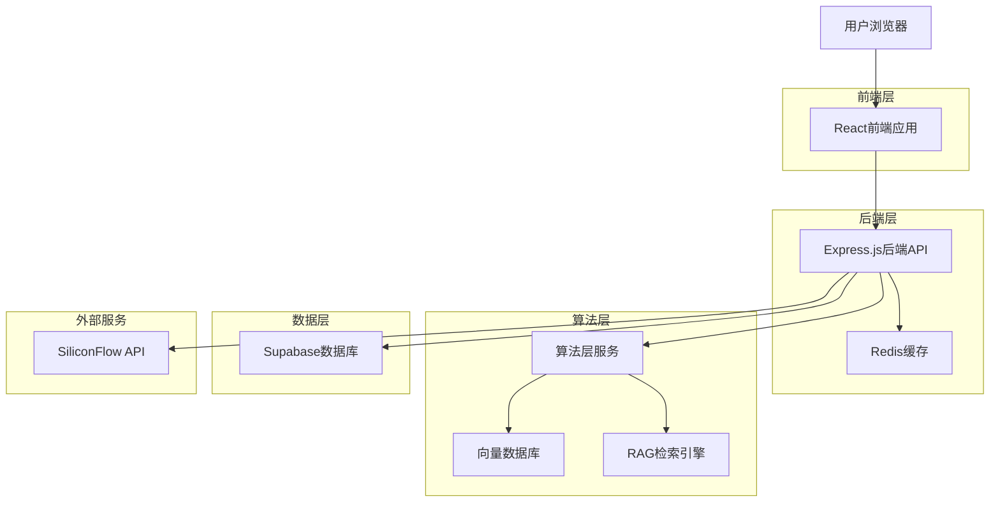
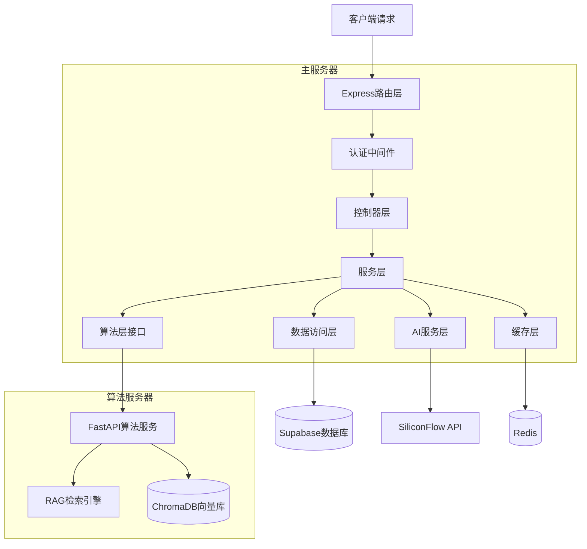
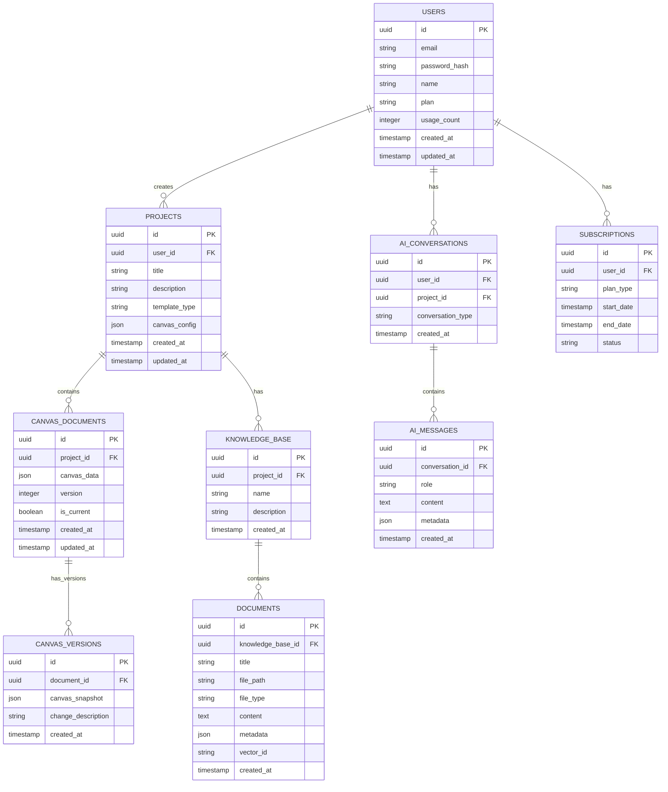

# 论文写作助手 - 技术架构文档

## 1. Architecture design



## 2. Technology Description
- 前端: React@18 + TypeScript + Tailwind CSS + Vite + React Router + Zustand + Fabric.js(Canvas)
- 后端: Node.js + Express@4 + TypeScript + JWT认证
- 算法层: Python + FastAPI + LangChain + ChromaDB + Sentence-Transformers
- 数据库: Supabase (PostgreSQL) + ChromaDB (向量数据库)
- 缓存: Redis (用于会话管理和API限流)
- AI服务: SiliconFlow API (兼容OpenAI格式)
- 部署: 前端Vercel，后端Railway/Render，算法层独立部署

## 3. Route definitions
| Route | Purpose |
|-------|---------|
| / | 首页，产品介绍和Canvas演示 |
| /login | 用户登录页面 |
| /register | 用户注册页面 |
| /dashboard | 用户仪表板，项目概览 |
| /projects | 项目管理页面 |
| /canvas/:projectId | Canvas交互式编辑器主界面 |
| /knowledge | 知识库管理页面 |
| /settings | 用户设置和订阅管理 |
| /pricing | 付费计划页面 |

## 4. API definitions

### 4.1 Core API

用户认证相关
```
POST /api/auth/register
```
Request:
| Param Name | Param Type | isRequired | Description |
|------------|------------|------------|-------------|
| email | string | true | 用户邮箱 |
| password | string | true | 密码(至少8位) |
| name | string | true | 用户姓名 |

Response:
| Param Name | Param Type | Description |
|------------|------------|-------------|
| success | boolean | 注册是否成功 |
| token | string | JWT认证令牌 |
| user | User | 用户信息对象 |

Canvas编辑相关
```
GET /api/canvas/:projectId
```
Response:
| Param Name | Param Type | Description |
|------------|------------|-------------|
| canvas_data | Object | Canvas画布数据(JSON格式) |
| version | number | 当前版本号 |

```
PUT /api/canvas/:projectId
```
Request:
| Param Name | Param Type | isRequired | Description |
|------------|------------|------------|-------------|
| canvas_data | Object | true | Canvas画布数据 |
| auto_save | boolean | false | 是否自动保存 |

AI协作功能相关
```
POST /api/ai/collaborate
```
Request:
| Param Name | Param Type | isRequired | Description |
|------------|------------|------------|-------------|
| user_input | string | true | 用户输入的写作要求 |
| canvas_context | Object | true | 当前Canvas上下文 |
| project_id | string | true | 项目ID |

Response:
| Param Name | Param Type | Description |
|------------|------------|-------------|
| thinking_process | string | AI的修改思路 |
| generated_content | string | AI生成的文本内容 |
| render_position | Object | 建议渲染位置 |
| suggestions | string[] | 多个建议选项 |

```
POST /api/ai/enhance
```
Request:
| Param Name | Param Type | isRequired | Description |
|------------|------------|------------|-------------|
| content | string | true | 需要增强的内容 |
| enhancement_type | string | true | 增强类型(grammar/style/academic) |

RAG知识库相关
```
POST /api/knowledge/upload
```
Request:
| Param Name | Param Type | isRequired | Description |
|------------|------------|------------|-------------|
| file | File | true | 上传的文献文件 |
| project_id | string | true | 关联的项目ID |

```
POST /api/knowledge/search
```
Request:
| Param Name | Param Type | isRequired | Description |
|------------|------------|------------|-------------|
| query | string | true | 检索查询 |
| project_id | string | true | 项目ID |
| top_k | number | false | 返回结果数量 |

Response:
| Param Name | Param Type | Description |
|------------|------------|-------------|
| results | Array | 检索结果列表 |
| relevance_scores | Array | 相关性分数 |

### 4.2 算法层API

```
POST /algorithm/rag/index
```
Request:
| Param Name | Param Type | isRequired | Description |
|------------|------------|------------|-------------|
| document_content | string | true | 文档内容 |
| document_id | string | true | 文档ID |
| metadata | Object | false | 文档元数据 |

```
POST /algorithm/rag/retrieve
```
Request:
| Param Name | Param Type | isRequired | Description |
|------------|------------|------------|-------------|
| query | string | true | 查询文本 |
| top_k | number | false | 返回数量 |
| filter | Object | false | 过滤条件 |

## 5. Server architecture diagram



## 6. Data model

### 6.1 Data model definition



### 6.2 Data Definition Language

用户表 (users)
```sql
-- 创建用户表
CREATE TABLE users (
    id UUID PRIMARY KEY DEFAULT gen_random_uuid(),
    email VARCHAR(255) UNIQUE NOT NULL,
    password_hash VARCHAR(255) NOT NULL,
    name VARCHAR(100) NOT NULL,
    plan VARCHAR(20) DEFAULT 'free' CHECK (plan IN ('free', 'premium')),
    usage_count INTEGER DEFAULT 0,
    created_at TIMESTAMP WITH TIME ZONE DEFAULT NOW(),
    updated_at TIMESTAMP WITH TIME ZONE DEFAULT NOW()
);

-- 创建索引
CREATE INDEX idx_users_email ON users(email);
CREATE INDEX idx_users_plan ON users(plan);
```

项目表 (projects)
```sql
-- 创建项目表
CREATE TABLE projects (
    id UUID PRIMARY KEY DEFAULT gen_random_uuid(),
    user_id UUID NOT NULL REFERENCES users(id) ON DELETE CASCADE,
    title VARCHAR(255) NOT NULL,
    description TEXT,
    template_type VARCHAR(50) DEFAULT 'blank',
    canvas_config JSON DEFAULT '{}',
    created_at TIMESTAMP WITH TIME ZONE DEFAULT NOW(),
    updated_at TIMESTAMP WITH TIME ZONE DEFAULT NOW()
);

-- 创建索引
CREATE INDEX idx_projects_user_id ON projects(user_id);
CREATE INDEX idx_projects_created_at ON projects(created_at DESC);
```

Canvas文档表 (canvas_documents)
```sql
-- 创建Canvas文档表
CREATE TABLE canvas_documents (
    id UUID PRIMARY KEY DEFAULT gen_random_uuid(),
    project_id UUID NOT NULL REFERENCES projects(id) ON DELETE CASCADE,
    canvas_data JSON NOT NULL DEFAULT '{}',
    version INTEGER DEFAULT 1,
    is_current BOOLEAN DEFAULT true,
    created_at TIMESTAMP WITH TIME ZONE DEFAULT NOW(),
    updated_at TIMESTAMP WITH TIME ZONE DEFAULT NOW()
);

-- 创建索引
CREATE INDEX idx_canvas_documents_project_id ON canvas_documents(project_id);
CREATE INDEX idx_canvas_documents_version ON canvas_documents(project_id, version);
```

知识库表 (knowledge_base)
```sql
-- 创建知识库表
CREATE TABLE knowledge_base (
    id UUID PRIMARY KEY DEFAULT gen_random_uuid(),
    project_id UUID NOT NULL REFERENCES projects(id) ON DELETE CASCADE,
    name VARCHAR(255) NOT NULL,
    description TEXT,
    created_at TIMESTAMP WITH TIME ZONE DEFAULT NOW()
);

-- 创建文档表
CREATE TABLE documents (
    id UUID PRIMARY KEY DEFAULT gen_random_uuid(),
    knowledge_base_id UUID NOT NULL REFERENCES knowledge_base(id) ON DELETE CASCADE,
    title VARCHAR(255) NOT NULL,
    file_path VARCHAR(500),
    file_type VARCHAR(50),
    content TEXT,
    metadata JSON DEFAULT '{}',
    vector_id VARCHAR(255), -- ChromaDB中的向量ID
    created_at TIMESTAMP WITH TIME ZONE DEFAULT NOW()
);

-- 创建索引
CREATE INDEX idx_documents_knowledge_base_id ON documents(knowledge_base_id);
CREATE INDEX idx_documents_vector_id ON documents(vector_id);
```

AI对话表 (ai_conversations, ai_messages)
```sql
-- 创建AI对话表
CREATE TABLE ai_conversations (
    id UUID PRIMARY KEY DEFAULT gen_random_uuid(),
    user_id UUID NOT NULL REFERENCES users(id) ON DELETE CASCADE,
    project_id UUID REFERENCES projects(id) ON DELETE CASCADE,
    conversation_type VARCHAR(50) DEFAULT 'canvas_collaboration',
    created_at TIMESTAMP WITH TIME ZONE DEFAULT NOW()
);

-- 创建AI消息表
CREATE TABLE ai_messages (
    id UUID PRIMARY KEY DEFAULT gen_random_uuid(),
    conversation_id UUID NOT NULL REFERENCES ai_conversations(id) ON DELETE CASCADE,
    role VARCHAR(20) NOT NULL CHECK (role IN ('user', 'assistant', 'system')),
    content TEXT NOT NULL,
    metadata JSON DEFAULT '{}',
    created_at TIMESTAMP WITH TIME ZONE DEFAULT NOW()
);

-- 创建索引
CREATE INDEX idx_ai_conversations_user_id ON ai_conversations(user_id);
CREATE INDEX idx_ai_messages_conversation_id ON ai_messages(conversation_id);
CREATE INDEX idx_ai_messages_created_at ON ai_messages(created_at DESC);
```

订阅表 (subscriptions)
```sql
-- 创建订阅表
CREATE TABLE subscriptions (
    id UUID PRIMARY KEY DEFAULT gen_random_uuid(),
    user_id UUID NOT NULL REFERENCES users(id) ON DELETE CASCADE,
    plan_type VARCHAR(20) NOT NULL CHECK (plan_type IN ('free', 'premium', 'enterprise')),
    start_date TIMESTAMP WITH TIME ZONE DEFAULT NOW(),
    end_date TIMESTAMP WITH TIME ZONE,
    status VARCHAR(20) DEFAULT 'active' CHECK (status IN ('active', 'cancelled', 'expired')),
    created_at TIMESTAMP WITH TIME ZONE DEFAULT NOW()
);

-- 创建索引
CREATE INDEX idx_subscriptions_user_id ON subscriptions(user_id);
CREATE INDEX idx_subscriptions_status ON subscriptions(status);

-- 启用行级安全
ALTER TABLE subscriptions ENABLE ROW LEVEL SECURITY;

-- 创建RLS策略
CREATE POLICY "用户只能查看自己的订阅" ON subscriptions
    FOR ALL USING (auth.uid() = user_id);
```

初始化数据
```sql
-- 插入示例用户（仅用于开发测试）
INSERT INTO users (email, password_hash, name, plan) VALUES
('demo@example.com', '$2b$10$example_hash', '演示用户', 'premium');

-- 创建更新时间触发器函数
CREATE OR REPLACE FUNCTION update_updated_at_column()
RETURNS TRIGGER AS $$
BEGIN
    NEW.updated_at = NOW();
    RETURN NEW;
END;
$$ language 'plpgsql';

-- 为需要的表添加更新时间触发器
CREATE TRIGGER update_users_updated_at BEFORE UPDATE ON users
    FOR EACH ROW EXECUTE FUNCTION update_updated_at_column();

CREATE TRIGGER update_projects_updated_at BEFORE UPDATE ON projects
    FOR EACH ROW EXECUTE FUNCTION update_updated_at_column();

CREATE TRIGGER update_documents_updated_at BEFORE UPDATE ON documents
    FOR EACH ROW EXECUTE FUNCTION update_updated_at_column();

CREATE TRIGGER update_ai_conversations_updated_at BEFORE UPDATE ON ai_conversations
    FOR EACH ROW EXECUTE FUNCTION update_updated_at_column();
```

## 7. 项目文件结构

```
论文写作助手/
├── frontend/                          # React前端项目
│   ├── public/
│   │   ├── index.html
│   │   └── favicon.ico
│   ├── src/
│   │   ├── components/                # 通用组件
│   │   │   ├── ui/                   # UI基础组件
│   │   │   │   ├── Button.tsx
│   │   │   │   ├── Input.tsx
│   │   │   │   ├── Modal.tsx
│   │   │   │   └── Loading.tsx
│   │   │   ├── layout/               # 布局组件
│   │   │   │   ├── Header.tsx
│   │   │   │   ├── Sidebar.tsx
│   │   │   │   └── Layout.tsx
│   │   │   └── editor/               # 编辑器组件
│   │   │       ├── RichTextEditor.tsx
│   │   │       ├── AIAssistant.tsx
│   │   │       └── DocumentOutline.tsx
│   │   ├── pages/                    # 页面组件
│   │   │   ├── HomePage.tsx
│   │   │   ├── LoginPage.tsx
│   │   │   ├── RegisterPage.tsx
│   │   │   ├── DashboardPage.tsx
│   │   │   ├── ProjectsPage.tsx
│   │   │   ├── EditorPage.tsx
│   │   │   ├── AIAssistantPage.tsx
│   │   │   └── SettingsPage.tsx
│   │   ├── hooks/                    # 自定义Hooks
│   │   │   ├── useAuth.ts
│   │   │   ├── useProjects.ts
│   │   │   ├── useAI.ts
│   │   │   └── useLocalStorage.ts
│   │   ├── services/                 # API服务
│   │   │   ├── api.ts
│   │   │   ├── auth.ts
│   │   │   ├── projects.ts
│   │   │   └── ai.ts
│   │   ├── store/                    # 状态管理
│   │   │   ├── authStore.ts
│   │   │   ├── projectStore.ts
│   │   │   └── editorStore.ts
│   │   ├── types/                    # TypeScript类型定义
│   │   │   ├── auth.ts
│   │   │   ├── project.ts
│   │   │   └── ai.ts
│   │   ├── utils/                    # 工具函数
│   │   │   ├── constants.ts
│   │   │   ├── helpers.ts
│   │   │   └── validation.ts
│   │   ├── styles/                   # 样式文件
│   │   │   └── globals.css
│   │   ├── App.tsx
│   │   ├── main.tsx
│   │   └── vite-env.d.ts
│   ├── package.json
│   ├── vite.config.ts
│   ├── tailwind.config.js
│   └── tsconfig.json
├── backend/                           # Node.js后端项目
│   ├── src/
│   │   ├── controllers/              # 控制器层
│   │   │   ├── authController.ts
│   │   │   ├── projectController.ts
│   │   │   ├── documentController.ts
│   │   │   └── aiController.ts
│   │   ├── services/                 # 服务层
│   │   │   ├── authService.ts
│   │   │   ├── projectService.ts
│   │   │   ├── documentService.ts
│   │   │   ├── aiService.ts
│   │   │   └── emailService.ts
│   │   ├── models/                   # 数据模型
│   │   │   ├── User.ts
│   │   │   ├── Project.ts
│   │   │   ├── Document.ts
│   │   │   └── AIConversation.ts
│   │   ├── middleware/               # 中间件
│   │   │   ├── auth.ts
│   │   │   ├── validation.ts
│   │   │   ├── rateLimit.ts
│   │   │   └── errorHandler.ts
│   │   ├── routes/                   # 路由定义
│   │   │   ├── auth.ts
│   │   │   ├── projects.ts
│   │   │   ├── documents.ts
│   │   │   └── ai.ts
│   │   ├── config/                   # 配置文件
│   │   │   ├── database.ts
│   │   │   ├── redis.ts
│   │   │   └── ai.ts
│   │   ├── utils/                    # 工具函数
│   │   │   ├── jwt.ts
│   │   │   ├── bcrypt.ts
│   │   │   ├── validation.ts
│   │   │   └── logger.ts
│   │   ├── types/                    # TypeScript类型
│   │   │   ├── express.d.ts
│   │   │   └── api.ts
│   │   └── app.ts                    # Express应用入口
│   ├── package.json
│   ├── tsconfig.json
│   └── .env.example
├── database/                          # 数据库相关
│   ├── migrations/                   # 数据库迁移文件
│   │   ├── 001_create_users.sql
│   │   ├── 002_create_projects.sql
│   │   ├── 003_create_documents.sql
│   │   └── 004_create_ai_tables.sql
│   └── seeds/                        # 初始数据
│       └── demo_data.sql
├── docs/                             # 项目文档
│   ├── API.md                        # API文档
│   ├── DEPLOYMENT.md                 # 部署指南
│   └── DEVELOPMENT.md                # 开发指南
├── docker-compose.yml                # Docker编排文件
├── .gitignore
└── README.md                         # 项目说明
```

## 8. SiliconFlow API集成

### 8.1 API配置
```javascript
// backend/src/services/aiService.ts
const SILICONFLOW_CONFIG = {
  baseURL: 'https://api.siliconflow.com/v1',
  apiKey: process.env.SILICONFLOW_API_KEY,
  model: 'gpt-3.5-turbo', // 或其他支持的模型
  maxTokens: 2000,
  temperature: 0.7
};
```

### 8.2 Canvas协作集成
```javascript
// AI协作功能实现
async function collaborateWithAI(userInput, canvasContext) {
  const response = await fetch('https://api.siliconflow.com/v1/chat/completions', {
    method: 'POST',
    headers: {
      'Authorization': `Bearer ${SILICONFLOW_API_KEY}`,
      'Content-Type': 'application/json'
    },
    body: JSON.stringify({
      model: 'gpt-3.5-turbo',
      messages: [
        {
          role: 'system',
          content: '你是一个专业的学术写作助手，帮助用户改进论文内容...'
        },
        {
          role: 'user',
          content: `当前Canvas内容：${canvasContext}\n用户要求：${userInput}`
        }
      ]
    })
  });
  
  return response.json();
}
```